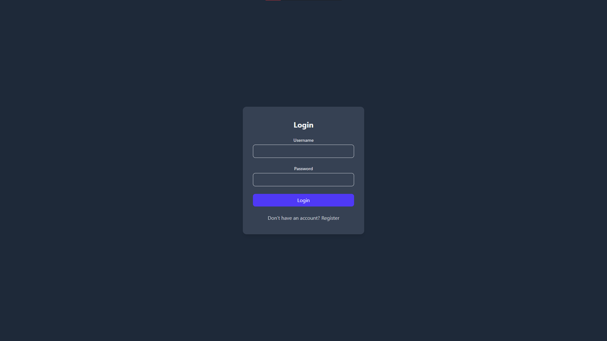
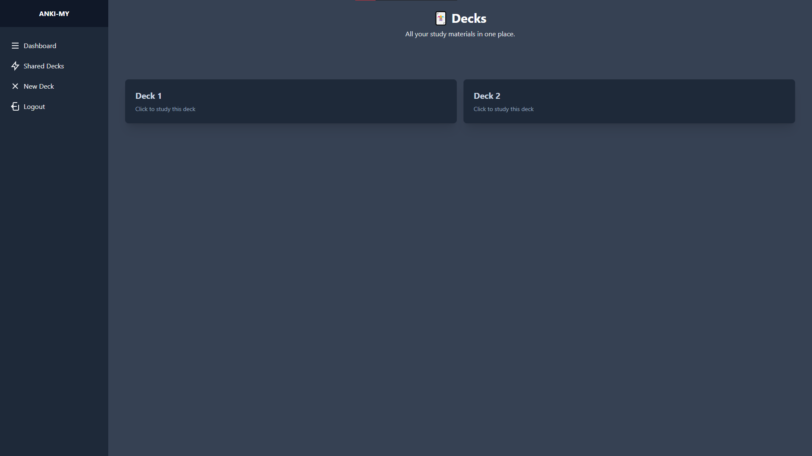
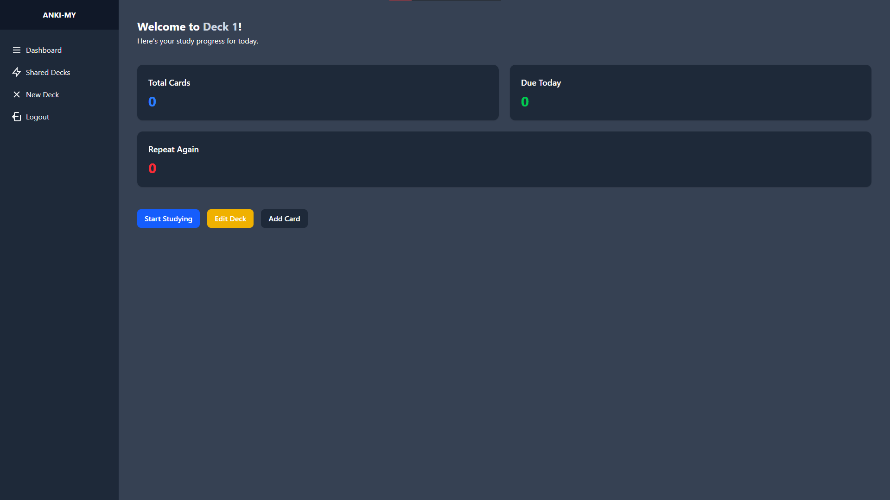
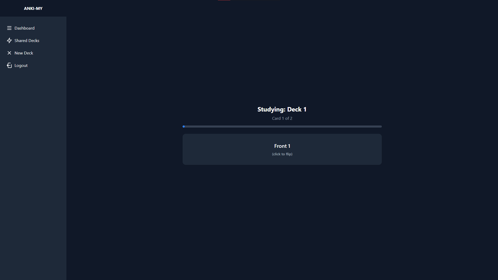

# Anki-My

A self-hosted flashcard app inspired by Anki, built with React + TypeScript on the frontend and Rust (Rocket) on the backend.



## Screenshots

| Decks | Deck Page | Study |
|---|---|---|
|  |  |  |

## Features

- JWT authentication (register/login)
- Create and manage decks
- Add cards with front/back
- Browse shared public decks
- Filter decks by name

## Stack

| Layer | Tech |
|---|---|
| Frontend | React 19, TypeScript, Vite, TailwindCSS |
| Backend | Rust, Rocket 0.5, SQLx |
| Database | PostgreSQL |
| Auth | JWT (24h expiry), bcrypt passwords |

## Quick Start

### Prerequisites

- Node.js + npm
- Rust + Cargo
- PostgreSQL

### 1. Clone

```bash
git clone https://github.com/matheusCsousa/Anki-my.git
cd Anki-my
```

### 2. Backend

```bash
cd backend
cp .env.example .env   # fill in DATABASE_URL and JWT_SECRET
cargo run
```

Backend runs on `http://localhost:8000`.

### 3. Frontend

```bash
cd frontend
npm install
cp .env.example .env   # set VITE_API_URL=http://localhost:8000
npm run dev
```

Frontend runs on `http://localhost:5173`.

## Project Structure

```
Anki-my/
├── backend/    # Rust/Rocket REST API
└── frontend/   # React/TypeScript SPA
```

See each subdirectory's README for detailed setup.
